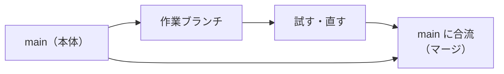

Claude Code を使うと必ず出てくるのが Git です。**Git は「巨大な元に戻す機能」**だと思ってください。それだけ分かれば読めます。

（フォルダ・パス・環境変数などの基本語は第1章にまとめました）

---

## Git（ギット）

**一言でいうと**: 変更履歴を記録する仕組み。**巨大な「元に戻す」機能**。

Word の変更履歴や Google ドキュメントの版履歴に近いものです。ただし対象が**フォルダ全体**で、記録するタイミングを**自分で決められます**。

:::message
**GitHub（ギットハブ）は別物です。**

- **Git** = 記録する仕組み（あなたのパソコンの中）
- **GitHub** = 記録をインターネット上に置いて共有するサービス

だから `git commit`（記録する）は手元の操作、`git push`（送る）は外に出る操作、という違いが生まれます。
:::

## リポジトリ（Repository / レポ）

**一言でいうと**: 変更履歴が記録されるプロジェクトフォルダ。

普通のフォルダとの違いは、**過去のすべての状態に戻せる**という点だけです。中に `.git` という隠しフォルダがあると、それはリポジトリです。

## ワーキングツリー（Working Tree）

**一言でいうと**: 今あなたが見ている、実際のファイルたち。

「作業ツリー」とも書かれます。**編集中の生の状態**を指します。

## ステージング / index（ステージ）

**一言でいうと**: 「次の記録に含めるもの」を並べておく台。

セーブする前に「これとこれを含める」と選ぶ場所です。`git add` でここに乗せ、`git commit` で記録します。

**2段階になっている理由**は、「関係ある変更だけをまとめて記録できる」ようにするためです。

## HEAD（ヘッド）

**一言でいうと**: 今どの記録の上に立っているか、を指す矢印。

`HEAD` が今の基準点です。「1つ前」を `HEAD~1` と書きます。

## デタッチ HEAD（detached HEAD）

**一言でいうと**: 枝の上ではなく、過去の記録そのものの上に立ってしまった状態。

**壊れてはいません。** 過去を見に行っただけです。困ったら `git switch main` で戻れます。

---

## コミット（Commit）

**一言でいうと**: 「ここまでの変更を1つの記録として保存する」操作。**セーブポイント。**


ゲームのセーブと同じです。コミットしておけば、あとで**その時点まで丸ごと戻せます**。

:::message alert
逆に言うと、**コミットしていない変更は Git では戻せません。**

AI に大きな作業を頼む前にコミットしておくのが、**一番効く保険**です。一言頼めば済みます。

```
作業を始める前に、今の状態をコミットして
```
:::

## ブランチ（Branch）

**一言でいうと**: 作業用のコピー。本体を壊さずに試すための分かれ道。

`main`（メイン）という名前が本体で、そこから枝を伸ばして作業し、うまくいったら本体に合流させます。



## マージ（Merge）

**一言でいうと**: 枝の作業を本体に合流させること。

## コンフリクト（Conflict / 競合）

**一言でいうと**: 2つの作業が**同じ場所**を別々に書き換えたため、どちらを採用するか機械が決められない状態。

**エラーではありません。** 人間が決めるべき場面に来た、という合図です。

:::message
自分で解決しようとせず、こう聞くのが速いです。

```
コンフリクトの内容を日本語で説明して。どちらを残すべきか教えて
```
:::

## リベース（Rebase）

**一言でいうと**: 枝の付け根を、別の場所に付け替える操作。履歴が書き換わる。

履歴がきれいになりますが、**すでに共有した履歴に対して行うと他の人が混乱します**。AI が提案してきたら、共有済みかどうかを気にしてください。

## スタッシュ（Stash）

**一言でいうと**: 作業中の変更を一時的にどこかへ避けておく操作。

「今の作業を中断して別のことをしたい」ときに使います。`git stash pop` で戻します。**避けた変更を忘れやすい**のが唯一の注意点です。

## タグ（Tag）

**一言でいうと**: ある記録に貼る名札。「v1.0」など。

---

## diff / 差分（ディフ）

**一言でいうと**: 変更前と変更後の**違いだけ**を並べた表示。

Word の「変更履歴の表示」と同じものです。

```diff
- 請求書の締め日は月末です
+ 請求書の締め日は毎月25日です
```

| 記号 | 意味 |
| --- | --- |
| `-`（赤） | **消された**行 |
| `+`（緑） | **追加された**行 |

**AI が何を変えたか確認する一番速い方法**がこれです。

---

## origin / upstream / remote（リモート）

**一言でいうと**: インターネット上に置いてある、同じリポジトリのコピーの呼び名。

| 呼び名 | 意味 |
| --- | --- |
| **remote** | 遠くにあるリポジトリ全般 |
| **origin** | 自分がクローンしてきた元。**既定の名前** |
| **upstream** | フォーク元（本家）に付ける慣習的な名前 |

## クローン（Clone）/ フォーク（Fork）

| 言葉 | 意味 |
| --- | --- |
| **クローン** | 遠くのリポジトリを**自分のパソコンに**丸ごと持ってくる |
| **フォーク** | 他人のリポジトリを**自分のアカウントに**コピーする（GitHub 上の操作） |

## プルリクエスト / PR（Pull Request）

**一言でいうと**: 「この変更を本体に入れていいですか」という**申請**。

社内の稟議・承認申請とほぼ同じ役割です。他の人がレビューして承認します。GitHub 上では「PR」と略されます。

## `.gitignore`（ギットイグノア）

**一言でいうと**: 「これは記録しなくていい」というファイルの一覧。

`node_modules` や `.env` をここに書いておくと、記録にも共有にも含まれません。**`.env` が入っているか確認する価値があります。**

---

## 取り消せるか早見表

Git のコマンドで一番大事なのは「**やり直せるか**」です。

| 操作 | 取り消せるか |
| --- | --- |
| `git add` | ✅ 簡単（`git restore --staged`） |
| `git commit` | ✅ 簡単（`git reset --soft HEAD~1`） |
| `git switch` / `git checkout`（ブランチ移動） | ✅ 戻れる |
| `git stash` | ✅ `git stash pop` で戻る |
| `git merge` | 🟡 やり直せるが手間 |
| `git rebase` | 🟡 履歴が書き換わる。共有済みなら要注意 |
| **`git reset --hard`** | 🔴 **保存前の作業が消える** |
| **`git clean -fd`** | 🔴 **記録外のファイルが消える** |
| **`git push`** | 🔴 **外に出る**。取り消しにくい |
| **`git push --force`** | 🔴 **他人の作業を上書きしうる** |

:::message alert
🔴 の4つは、AI が提案してきたら**必ず内容を読んでください**。特に `git push` は、社内資料や顧客情報が混ざったまま送ると**情報が外に出ます**。`git status` で中身を確認してからにしてください。
:::

---

## gh（GitHub CLI）

**一言でいうと**: GitHub の操作をターミナルから行う道具。

Claude Code がよく使います。頻出のものだけ挙げます。

| コマンド | 意味 | 危険度 |
| --- | --- | --- |
| `gh pr list` / `gh pr view` | PR の一覧・中身を見る | 🟢 |
| `gh pr diff` | PR の差分を見る | 🟢 |
| `gh issue list` | issue の一覧を見る | 🟢 |
| `gh pr create` | **PR を作る**（GitHub 上に出る） | 🟡 |
| `gh pr merge` | **本体に取り込む** | 🔴 |
| `gh repo delete` | **リポジトリを削除** | 🔴 |

---

## この章のまとめ

| 覚えること |
| --- |
| Git ＝ **巨大な「元に戻す」機能**。GitHub は別物（共有サービス） |
| **コミット＝セーブポイント。作業前のコミットが最強の保険** |
| コミットしていない変更は戻せない |
| diff の `-` は削除、`+` は追加 |
| コンフリクトはエラーではなく「人が決める場面」 |
| 🔴 は `reset --hard` / `clean -fd` / `push` / `push --force` の4つ |

次の章から、実際のコマンドを見ていきます。
