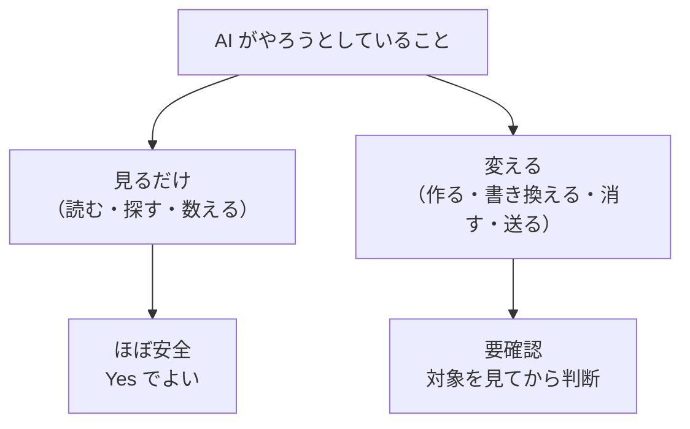

## この本は誰のためのものか

**プログラミングをしないけれど、Claude に実際の作業を任せることになった人**のための本です。

- 事務・総務・経理・営業などの職種で、AI に作業を任せてみたい人
- 上司や情シスから「これ使ってみて」と Claude Cowork や Claude Code を渡された人
- ChatGPT や Claude のチャットは使えるが、**ファイルを触られるのが怖い**人
- **黒い画面（ターミナル）が怖い**人

プログラミングを覚える必要はありません。この本のゴールは1つだけです。

:::message
**AI が「これを実行していいですか？」と聞いてきたとき、その意味が分かって Yes / No を自分で判断できるようになる。**
:::

:::message
**Claude Cowork と Claude Code の関係**
中身は同じ仕組みです。**Cowork は普通のアプリ画面**で、**Claude Code はターミナル（黒い画面）**で使うもの、という違いだけです。

事務作業なら **Cowork** から始めてください。この本の準備編は Cowork の手順を扱い、後半の用語とコマンドは**どちらにも共通**して役に立ちます。
:::

## なぜ用語集が必要なのか

Cowork も Claude Code も、チャットの AI と違って**あなたのパソコンの中で実際に作業をします**。だから作業のたびに、こういう表示が出ます。

```
● Bash(grep -rn "請求書" ./documents)
  ⎿  documents/2026-06.md:12: 請求書のテンプレートを更新
     documents/2026-07.md:3:  請求書の締め日
```

エンジニアなら一目で「フォルダの中を検索しただけだな」と分かります。でも初めて見た人には、**何が起きたのか、危険なのか安全なのか、まったく判断できません**。

判断できないと、次の2つのどちらかになります。

| 起きること | 結果 |
| --- | --- |
| 怖いので毎回止めてしまう | AI が使えず、手作業に戻る |
| 分からないまま全部 Yes を押す | いつか大事なファイルが消える |

どちらも避けたい。だから**意味が分かる**必要があります。

## この本の構成

準備編＋3部構成です。**頭から読む必要はありません。**困ったときに引いてください。

| 部 | 内容 | こんなときに読む |
| --- | --- | --- |
| **準備編** | Claude Desktop のインストール、Cowork の始め方、フォルダとプロジェクトの作り方 | **これから始める人** |
| **第1部** 画面の言葉 | プロンプト、コンテキスト、セッション、リポジトリなどのカタカナ語 | 説明を読んでも単語が分からないとき |
| **第2部** コマンド | `ls` `grep` `rm` など、AI が実行して見せるコマンド | 画面に見慣れない英語の命令が出たとき |
| **第3部** ログの読み方 | 画面表示の分解と、Yes / No の判断のしかた | 「実行していいですか？」と聞かれたとき |
| **付録** | `-rf` `~` `*` などの記号と、よく出るエラー文の逆引き | 記号やエラーの意味を調べたいとき |

**これから始める人は準備編から**、すでに使っていて困っている人は**第3部から**読んでください。

## 最初に覚えるべきたった1つの区別

用語を100個覚えるより、この区別を1つ覚えるほうが役に立ちます。



- **見るだけ** … ファイルを開く、フォルダの中身を一覧する、文字を検索する。**元に戻す必要すらない**ので安全です。
- **変える** … ファイルを作る、書き換える、消す、外部に送る。**ここだけ気をつければいい。**

第2部でコマンドを「見るだけ」と「変える」に分けて並べているのは、この区別をそのまま使えるようにするためです。

## 用語の書き方について

この本では、用語をこの形式で並べます。

> ### 単語（英語表記）
> **一言でいうと**: ひとことの説明
> よくある誤解や、身近なものへの例えを続けます。

「一言でいうと」だけ読んで済むように作ってあります。

それでは準備編から始めましょう。すでに動かせている人は、第3部「画面表示の読み方」まで飛んでください。
