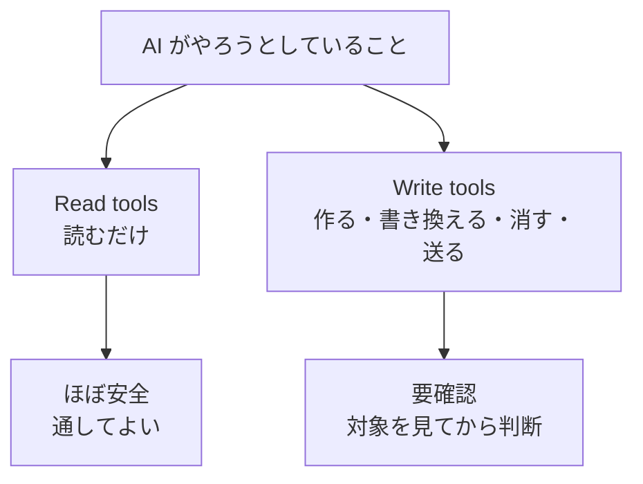

## この本は誰のためのものか

**プログラミングをしないけれど、AI に実際の作業を任せることになった人**のための本です。

- 事務・総務・経理・営業などの職種で、AI に作業を任せてみたい人
- 上司や情シスから「これ使ってみて」と Claude を渡された人
- ChatGPT や Claude のチャットは使えるが、**ファイルを触られるのが怖い**人

:::message
**この本ではターミナル（黒い画面）を使いません。**

扱うのは **Claude Cowork**、つまり普通のアプリ画面で動くほうの Claude です。コマンドを打つ必要はありません。日本語で頼むだけです。
:::

プログラミングを覚える必要はありません。この本のゴールは1つだけです。

:::message
**AI が「これをしていいですか？」と聞いてきたとき、その意味が分かって自分で判断できるようになる。**
:::

## なぜこの本が必要なのか

Cowork は、チャットの AI と違って**あなたのパソコンの中で実際に作業をします**。ファイルを開き、書き換え、新しく作ります。

だから作業の途中で、許可を求めてきます。そこで判断できないと、次の2つのどちらかになります。

| 起きること | 結果 |
| --- | --- |
| 怖いので毎回止めてしまう | AI が使えず、手作業に戻る |
| 分からないまま全部 Yes を押す | いつか大事なファイルが消える |

どちらも避けたい。だから**意味が分かる**必要があります。

## 安心してほしいこと

この本を書くにあたって公式ドキュメントを確認したところ、Anthropic 自身がこう書いていました。

:::message
> **タスクを監視せよ。コマンドを監視するのではない。**（Monitor tasks, not just commands）
>
> 何をしているかは表示しますが、**一つ一つのコマンドを検証しようとすべきではありません。**
:::

つまり**英語のコマンドを読めるようになる必要はありません**。これは公式のお墨付きです。

代わりに見るべきものは、たった2つです。

| 見るもの | 判断 |
| --- | --- |
| **承認を求められた操作の種類** | 削除・外部送信・追加接続なら止まる |
| **作業範囲がずれていないか** | 頼んでいない場所に触っていたら止める |

この本の中心は、この2つを見分けられるようになることです。

## この本の構成

準備編＋3部構成です。**頭から読む必要はありません。**

| 部 | 内容 | こんなときに読む |
| --- | --- | --- |
| **準備編** | インストール、Cowork の始め方、フォルダとプロジェクトの作り方 | **これから始める人** |
| **第1部** 画面の言葉 | プロンプト、コンテキスト、セッション、Global instructions など | 説明の単語が分からないとき |
| **第2部** 承認画面の言葉 | Read/Write、削除保護、**プロンプトインジェクション**、止めるべきサイン | **「していいですか？」と聞かれたとき** |
| **第3部** コマンド1ページ | 英語のコマンドが見えたときの対応表 | 画面の英語が気になるとき |

**これから始める人は準備編から**、すでに使っていて困っている人は**第2部から**読んでください。

:::message
**第2部がこの本の本体です。** 迷ったらそこだけ読んでください。
:::

## 最初に覚えるべきたった1つの区別

用語を100個覚えるより、この区別を1つ覚えるほうが役に立ちます。公式が使っている分類そのままです。

- **読むだけ** … ファイルを開く、探す、数える。**元に戻す必要すらない**
- **変える** … 作る、書き換える、消す、外部に送る。**ここだけ気をつければいい**

## ターミナルを使う人向けの姉妹編

この本を読んで「ターミナルのほうも触ってみたい」と思ったら、続きがあります。

📘 **『黒い画面が読めるようになる本 — Claude Code コマンド・用語辞典』**

Git の言葉、コマンドのオプション一覧、`● Bash(...)` というログ表示の分解、記号とエラー文の逆引きを扱っています。

:::message
**事務作業をするだけなら、そちらは読まなくて構いません。** この本で足ります。
:::

それでは準備編から始めましょう。
