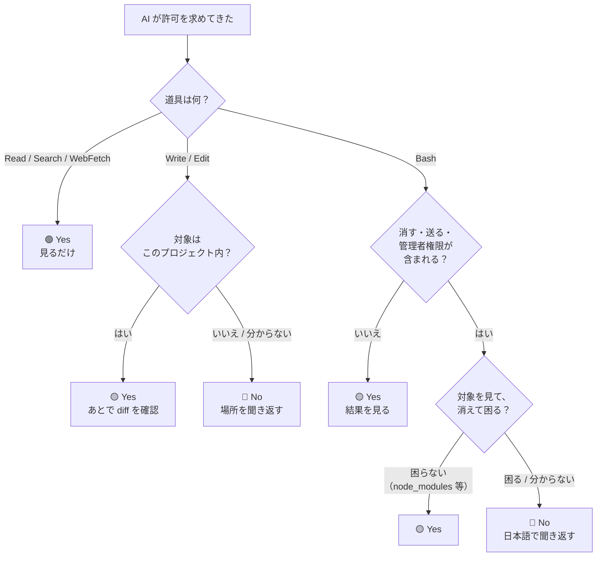

前の章の内容を、**1枚のフローチャート**にまとめます。この章だけ印刷して手元に置いても機能します。

---

## 判断フロー



分岐は4つだけです。慣れれば数秒で通れます。

---

## 無条件で止める6パターン

フローを覚えるのが面倒なら、**この6つだけ暗記**してください。これ以外はだいたい Yes で問題ありません。

| # | 見たら止めるもの | 理由 |
| --- | --- | --- |
| 1 | `rm -rf` の対象が**書類・資料フォルダ** | ゴミ箱に入らず完全に消える |
| 2 | `git push` / デプロイ / 本番反映 | **外に出る**。取り消しにくい |
| 3 | `.env` / `~/.ssh` / 認証情報ファイルを開こうとする | **パスワードや鍵が会話に残る** |
| 4 | `sudo` | パソコン全体の設定を変えられる |
| 5 | `DROP` / `WHERE` なしの `DELETE` | データが消える |
| 6 | **プロジェクトフォルダの外**を触ろうとする | 関係ないファイルへの影響 |

:::message
「プロジェクトフォルダの外」は、パスを見れば分かります。作業しているフォルダ名で始まっていないパス、特に `/Users/あなたの名前/` の直下や `~/` で始まるものが出たら、**なぜそこを触るのか聞いてください**。
:::

---

## 止めるときの言い方（コピーして使えます）

「No」を選んだ後、そのまま日本語で書けます。丁寧な英語は必要ありません。

**理由を説明させる**
```
それは実行しないで。まず何をするコマンドか、何が消えるかを日本語で説明して
```

**安全な代わりを頼む**
```
消す前に、消える予定のファイル一覧だけ表示して
```

**バックアップを先に取らせる**
```
その前にコミットしておいて。それから進めて
```

**範囲を限定する**
```
このプロジェクトのフォルダの外は触らないで
```

**機密ファイルを守る**
```
.env と鍵ファイルは開かないで。中身も出力しないで
```

---

## 事前に効かせる3つの予防策

判断の回数そのものを減らせます。

### ① 作業前にコミットする

**最強の保険です。** 何かおかしくなっても、この時点に丸ごと戻せます。

```
作業を始める前に、今の状態をコミットして
```

### ② CLAUDE.md にルールを書いておく

毎回言わなくて済みます。プロジェクトフォルダに `CLAUDE.md` というファイルを作り、こう書いておきます。

```markdown
# ルール

- 日本語で説明してください
- .env や鍵ファイルは開かない・中身を出力しない
- ファイルを削除する前に必ず一言確認する
- git push とデプロイは必ず事前に確認する
- このプロジェクトのフォルダの外は触らない
- 顧客の個人情報を成果物やログに含めない
```

これは AI が毎回自動で読むファイルです。**書いておくだけで、危ない提案そのものが減ります。**

### ③ 大事なフォルダは別の場所に置く

Claude Code は起動したフォルダを中心に作業します。**触られたくない資料は、作業フォルダの外に置く**のが確実です。

---

## それでも事故ったときの復旧

慌てなくて大丈夫です。まず AI に状況を伝えてください。

**コミット済みなら戻せます**
```
直前のコミットの状態に戻して
```

**何が起きたか分からないとき**
```
今のリポジトリの状態を確認して、何が変わったか・何が消えたかを日本語で報告して
```

:::message alert
**コミットしていない変更は Git では戻せません。** ただし macOS の Time Machine や Windows のファイル履歴、クラウド同期（Google Drive / OneDrive / Dropbox）のバージョン履歴から戻せる場合があります。慌てて新しい作業を上書きしないことが大切です。
:::

---

## この章のまとめ

| 覚えること |
| --- |
| 分岐は4つ。**道具 → 対象 → 消す/送るか → 困るか** |
| 無条件で止めるのは **6パターン**だけ |
| 迷ったら「日本語で説明して」と聞き返す。**これは正しい使い方** |
| 作業前のコミットが最強の保険 |
| CLAUDE.md にルールを書けば、判断の回数自体が減る |

これで本編は終わりです。次の付録には、記号とエラー文の逆引きを載せました。
