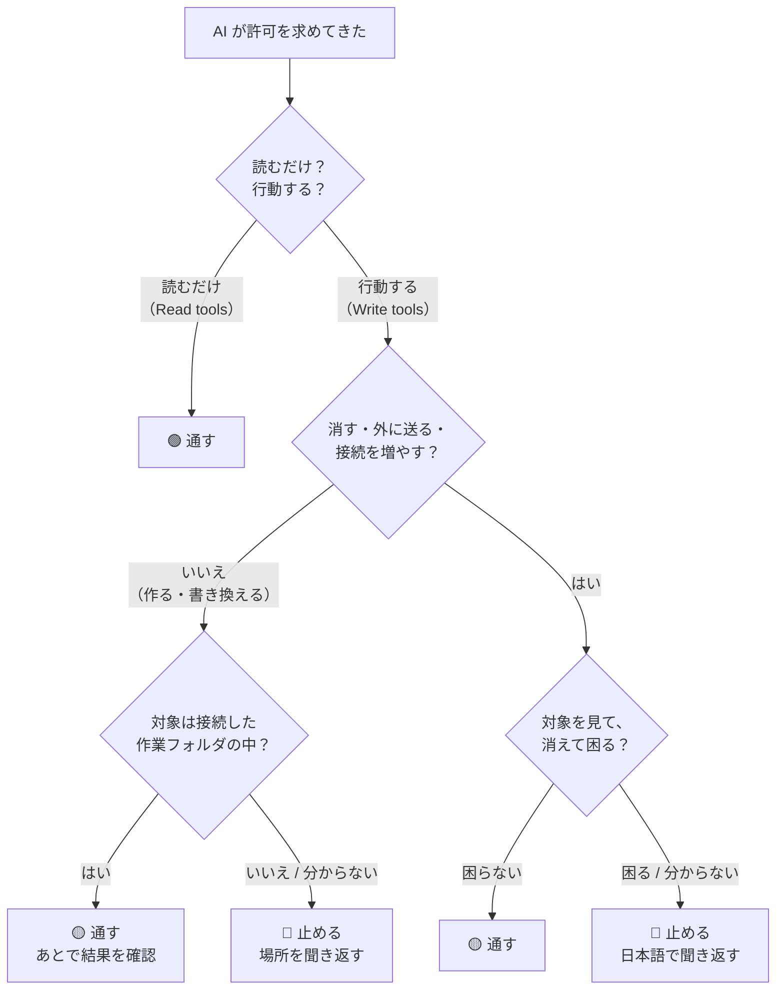

これまでの内容を、**1枚のフローチャート**にまとめます。この章だけ印刷して手元に置いても機能します。

---

## 判断フロー



分岐は4つだけです。慣れれば数秒で通れます。

:::message
第2部で見たとおり、**コマンドの中身を読む必要はありません**。「読むだけか、行動するか」だけで最初の分岐は済みます。
:::

---

## 無条件で止める6パターン

フローを覚えるのが面倒なら、**この6つだけ暗記**してください。これ以外はだいたい通して問題ありません。

| # | 止めるもの | 理由 |
| --- | --- | --- |
| 1 | **ファイルの削除**（削除の確認画面が出た） | ゴミ箱に入らず完全に消える |
| 2 | **外部への送信・公開・本番反映** | **外に出る**。取り消しにくい |
| 3 | **認証情報ファイルを開こうとする**（`.env` / 鍵ファイル） | **パスワードが記録に残る** |
| 4 | **フォルダの追加接続を求めてきた** | AI の作業範囲が広がる |
| 5 | **定期タスク（スケジュール）の新規作成** | あなたが見ていない時に動く |
| 6 | **接続した作業フォルダの外**を触ろうとする | 関係ないファイルへの影響 |


:::message
4と5は、公式が「**auto モードでも自動承認されない操作**」として名指ししているものです。つまり Anthropic 自身が「ここは人間が判断すべき」と線を引いた場所です。出てきたら本気で読む価値があります。
:::

:::message
**「作業フォルダの外」はパスを見れば分かります。** 接続したフォルダ名で始まっていないパス、特に `~/` で始まるものが出たら、**なぜそこを触るのか聞いてください**。
:::

---

## 「今後聞かない」を選んでよい場所

承認画面には「今後この種類は聞かない」という選択肢が出ることがあります。これは**便利ですが、選ぶ場所を間違えると安全装置が消えます**。


| 対象 | 「今後聞かない」を選んでよいか |
| --- | --- |
| 読むだけの操作 | ✅ 選んでよい（安全装置を外しても落ちない） |
| **削除・送信・接続追加** | ❌ **絶対に選ばない** |

---

## 止めるときの言い方（コピーして使えます）

止めた後、そのまま日本語で書けます。

**理由を説明させる**
```
それは実行しないで。何をしようとしているのか、
何が消えるのかを日本語で説明して
```

**安全な代わりを頼む**
```
消す前に、消える予定のファイル一覧だけ表示して
```

**元ファイルを守らせる**
```
元のファイルは書き換えないで。新しいファイルとして作って
```

**範囲を限定する**
```
接続したフォルダの外は触らないで
```

**機密ファイルを守る**
```
.env と鍵ファイルは開かないで。中身も出力しないで
```

**範囲がずれたと感じたとき**
```
いま何をしようとしているのか、なぜそれが必要なのか、日本語で説明して
```

---

## 事前に効かせる4つの予防策

判断の回数そのものを減らせます。**ここが一番費用対効果が高い部分です。**

### ① 原本ではなくコピーを渡す

**最強の保険です。** 原本を接続フォルダに置かなければ、最悪の結果は「コピーが無駄になった」だけになります。


### ② Global instructions にルールを書く

**設定 > Cowork** の Global instructions に一度書けば、全ての作業に効きます。

```
- 日本語で説明してください
- 私はプログラミングをしません。専門用語は避けてください
- 元のファイルは書き換えず、新しいファイルとして作ってください
- ファイルを削除・上書きする前に、必ず内容を説明して確認を取ってください
- .env や鍵ファイルは開かない・中身を出力しない
- 顧客の個人情報は成果物に含めないでください
```

**書いておくだけで、危ない提案そのものが減ります。**

### ③ 接続するフォルダを絞る

公式も「**広いアクセスを与えるより、AI 専用の作業フォルダを作ることを検討してほしい**」と明記しています。書類フォルダ全体を接続しないでください。

### ④ 承認モードは Manual から始める

慣れるまでは「手動で承認」のままにします。**慣れてから auto に上げる**順番が正解です。

:::message
公式も「お金・あなたの名前で送るメッセージ・重要なファイルが絡む作業では、近くで見ているか Manual に戻すことを検討せよ」と書いています。
:::

---

## それでも事故ったときの復旧

慌てなくて大丈夫です。まず AI に状況を聞いてください。

**何が起きたか分からないとき**
```
今の作業で何をしたか、変更したファイルと削除したファイルを
一覧で日本語で報告して
```

**成果物の場所が分からないとき**
```
作ったファイルはどこに保存した？
```

### ファイルが消えてしまった場合

| 手段 | 確認先 |
| --- | --- |
| **クラウド同期のバージョン履歴** | Google Drive / OneDrive / Dropbox の「以前のバージョン」 |
| **Time Machine**（Mac） | 該当フォルダを過去の日時で開く |
| **ファイル履歴**（Windows） | フォルダの「以前のバージョンの復元」 |
| **原本** | ①の予防策をしていれば、原本は無傷 |

:::message alert
**一番大事なのは「慌てて新しい作業を重ねない」ことです。** 上書きが進むと復元が難しくなります。まず手を止めて、上の一覧を確認してください。
:::

---

## この章のまとめ

| 覚えること |
| --- |
| 最初の分岐は「**読むだけか、行動するか**」だけ |
| 無条件で止めるのは **6パターン**だけ |
| **「今後聞かない」は読むだけの操作にしか使わない** |
| 迷ったら「日本語で説明して」。**これは正しい使い方** |
| **原本ではなくコピーを渡す**のが最強の保険 |
| Global instructions に書けば、判断の回数自体が減る |
| 事故ったら、まず手を止めてバージョン履歴を見る |

---

## おわりに

この本の内容を1文にまとめると、こうなります。

:::message
**英語が読めなくても構わない。「これは読むだけか、行動するか」「消えて困るか」だけ分かれば、AI は安全に使える。**
:::

そして分からないときの正解はいつも同じで、**日本語で聞き返すこと**です。Cowork は聞き返されることを前提に作られています。遠慮なく止めてください。

ターミナル側も触ってみたくなったら、姉妹編『黒い画面が読めるようになる本』でお待ちしています。
