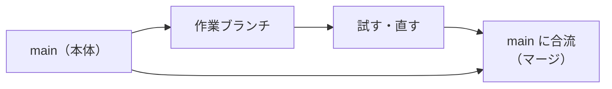

AI が作業する**場所**に関する言葉です。ここが分かると、画面に出るファイルの場所（パス）が読めるようになります。

---

## ディレクトリ（Directory）

**一言でいうと**: フォルダのこと。まったく同じ意味です。

エンジニアは「フォルダ」ではなく「ディレクトリ」と言う癖があります。**言い換えているだけ**なので、頭の中で「フォルダ」に置き換えて読んでください。

## パス（Path）

**一言でいうと**: ファイルの住所。どのフォルダのどのファイルかを表す文字列。

```
documents/2026/07/請求書.xlsx
```

`/`（スラッシュ）は**フォルダの区切り**です。つまり上の例は「documents フォルダ → 2026 フォルダ → 07 フォルダ → 請求書.xlsx」という意味です。

:::message
Windows のエクスプローラーでは `¥` や `\` で区切りますが、意味は同じです。Claude Code の画面では基本的に `/` が出ます。
:::

## カレントディレクトリ / 作業ディレクトリ（Current Directory）

**一言でいうと**: 今いるフォルダ。「ここ」がどこかということ。

ターミナルには**必ず「今どのフォルダにいるか」という状態があります**。エクスプローラーで開いているフォルダと同じ概念です。

これが分からないと「ファイルが見つからない」と言われる理由が分かりません。**探している場所が違うだけ**、というのが原因のほとんどです。

## 相対パスと絶対パス

**一言でいうと**: 「ここから見た道順」と「日本の住所のようなフルの住所」。

| 種類 | 例 | 意味 |
| --- | --- | --- |
| 相対パス | `documents/請求書.xlsx` | **今いるフォルダから見て** documents の中 |
| 絶対パス | `/Users/tanaka/documents/請求書.xlsx` | パソコンの一番上から数えた完全な住所 |

絶対パスは必ず `/` で始まります（Windows なら `C:\` で始まります）。

## リポジトリ（Repository / リポジトリ・レポ）

**一言でいうと**: 変更履歴が記録されるプロジェクトフォルダ。

普通のフォルダとの違いは、**過去のすべての状態に戻せる**という点だけです。「バージョン管理されたフォルダ」と考えてください。

## Git（ギット）

**一言でいうと**: 変更履歴を記録する仕組み。**巨大な「元に戻す」機能**。

Word の変更履歴や Google ドキュメントの版履歴に近いものです。ただし対象がフォルダ全体で、記録するタイミングを自分で決められます。

:::message
**GitHub（ギットハブ）は別物です。** Git が「記録する仕組み」、GitHub は「記録をインターネット上に置いて共有するサービス」です。
:::

## コミット（Commit）

**一言でいうと**: 「ここまでの変更を1つの記録として保存する」操作。セーブポイントを作ること。

ゲームのセーブと同じです。コミットしておけば、あとで**その時点まで丸ごと戻せます**。

:::message alert
逆に言うと、**コミットしていない変更は戻せません**。AI に大きな作業を頼む前にコミットしておくのが、一番効く保険です。
:::

## ブランチ（Branch）

**一言でいうと**: 作業用のコピー。本体を壊さずに試すための分かれ道。

`main`（メイン）という名前が本体で、そこから枝を伸ばして作業し、うまくいったら本体に合流させます。



## マージ（Merge）

**一言でいうと**: 枝の作業を本体に合流させること。

## diff / 差分（ディフ）

**一言でいうと**: 変更前と変更後の違いだけを並べた表示。

Word の「変更履歴の表示」と同じものです。画面ではこう出ます。

```diff
- 請求書の締め日は月末です
+ 請求書の締め日は毎月25日です
```

| 記号 | 意味 |
| --- | --- |
| `-`（赤） | **消された**行 |
| `+`（緑） | **追加された**行 |

**AI が何を変えたか確認する一番速い方法**がこれです。

## プルリクエスト / PR（Pull Request）

**一言でいうと**: 「この変更を本体に入れていいですか」という申請。

社内の稟議・承認申請とほぼ同じ役割です。他の人がレビューして承認します。

## 環境変数（Environment Variable）

**一言でいうと**: パソコンに覚えさせておく設定値。パスワードや接続先などを入れる場所。

`.env`（ドットイーエヌブイ）というファイルに書かれることが多く、**中身はパスワードや API キーなど機密情報**です。

:::message alert
`.env` や鍵ファイル（`~/.ssh` の中など）は、**AI に開かせない**のが原則です。中身が会話の記録に残ってしまいます。「.env は見ないで」と CLAUDE.md に書いておくのが確実です。
:::

## ログ（Log）

**一言でいうと**: 動作の記録。何が起きたかが時系列で並んだ文章。

エラーの原因はほぼログに書いてあります。読めなくても構いません。**そのままコピーして AI に貼れば十分**です。

## エラー（Error）

**一言でいうと**: 失敗の通知。**壊れたという意味ではありません。**

「できませんでした」という報告です。赤い文字が出ても慌てなくて大丈夫で、多くは打ち間違いや場所の間違いです。

## デバッグ（Debug）

**一言でいうと**: うまく動かない原因を探して直す作業。

## npm / package.json（エヌピーエム）

**一言でいうと**: 部品を取り寄せる仕組みと、その部品リスト。

`npm install` は「**必要な部品をまとめて取り寄せる**」という意味です。時間がかかりますが、通常は安全な操作です。

## ビルド（Build）

**一言でいうと**: 書いたものを、実際に動く形に組み立てる作業。

原稿を印刷用データに変換するようなイメージです。

---

## この章のまとめ

| 覚えること | 実用的な意味 |
| --- | --- |
| `/` はフォルダの区切り | パスは「住所」として読める |
| コミット＝セーブポイント | **作業前にコミット**が最強の保険 |
| diff の `-` は削除、`+` は追加 | AI の変更内容を確認する手段 |
| `.env` は機密 | AI に開かせない |

次の第2部では、実際に画面に出てくるコマンドを見ていきます。
